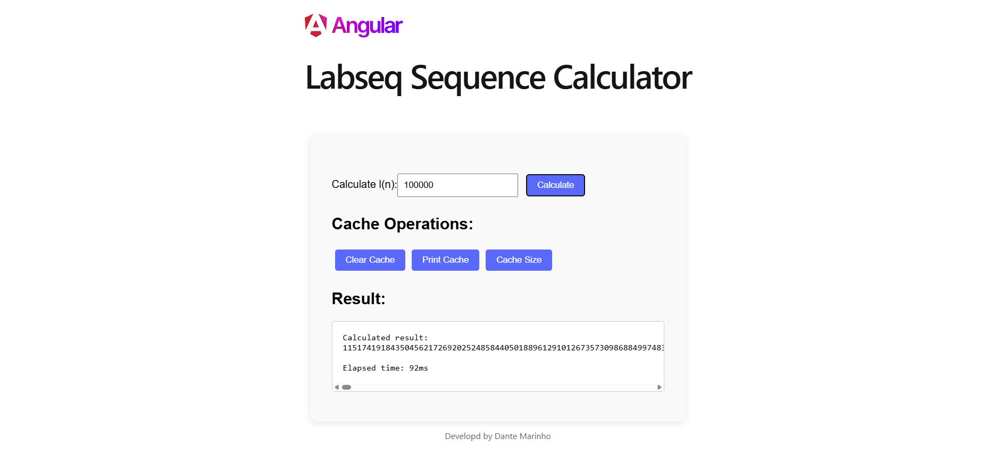

# Labseq Sequence » API Quarkus + Frontend Angular

Exercice from Altice Labs.



## What was developed?

- `api/`: REST service made with Quarkus to calculate the labseq sequence
  - Endpoins in `Swagger` documentation:
    - `GET`: `/labseq/{n}` » Calculates the value of l(n) from the labseq sequence
    - `GET`: `/labseq/clearCache` » Clears the cache
    - `GET`: `/labseq/printCache` » Returns the current cache key.value pairs
    - `GET`: `/labseq/size` » Returns the current size of the cache
- `frontend/`: Interface web simples para consumir a API e visualizar os resultados.

## Running the application in dev mode

### API

You can run your API application in dev mode that enables live coding using:

```shell script
cd api
./mvnw quarkus:dev
```

### Swagger UI

In browser:
```
http://localhost:8080/swagger-ui/
```

### Frontend

```shell script
cd frontend
npm install
npm run start
```

In browser:
```
http://localhost:4200
```

## Credits and Resources

- All ChatGPT conversation  
  https://chatgpt.com/share/682fbbfb-dac8-800c-a0c3-da280e1c94c7

- Quarkus Iniciante #1: Primeiros passos / Primeira app
  https://www.youtube.com/watch?v=jAsbKysJMLU&list=PL9K59CMzoAG-IWvaSXnv6HbkFDX_L0HM7&index=2

- Formatting a long system.out.print containing many strings & integers  
  https://stackoverflow.com/questions/34954236/formatting-a-long-system-out-print-containing-many-strings-integers

- Maneiras de medir o tempo em Java sem bibliotecas externas  
  https://thiagovespa.com.br/blog/2015/09/29/maneiras-de-medir-o-tempo-em-java-sem-bibliotecas-externas/

- Consuming REST API  
  https://app.insomnia.rest/

- Spinners and loaders in pure CSS  
  https://codepen.io/Ferie/pen/wQMvXV

## Stack and Programs Used

- IntelliJ IDEA Ultimate  
  https://www.jetbrains.com/idea/download/?section=windows

- Visual Studio Code  
  https://code.visualstudio.com/

- Angular 19.2.0
  https://angular.dev/

- Quarkus 3.22  
  https://code.quarkus.io/

- JDK Eclipse Temurin 17.0.15
