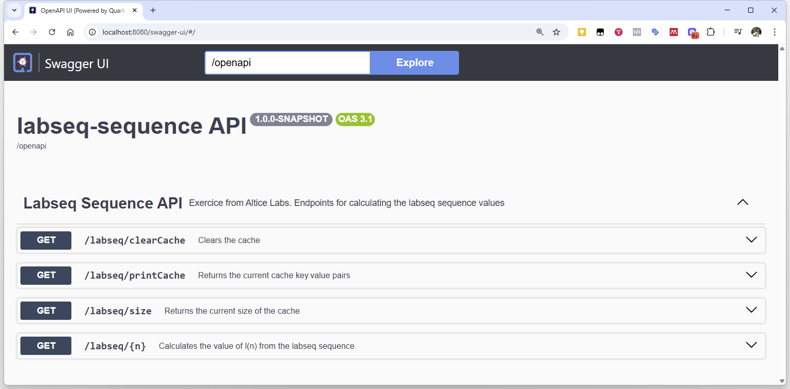

# Labseq Sequence » API Quarkus

Exercice from Altice Labs.



## What was developed?

- `api/`: REST service made with Quarkus to calculate the labseq sequence
  - Endpoins in `Swagger` documentation:
    - `GET`: `/labseq/{n}` » Calculates the value of l(n) from the labseq sequence
    - `GET`: `/labseq/clearCache` » Clears the cache
    - `GET`: `/labseq/printCache` » Returns the current cache key.value pairs
    - `GET`: `/labseq/size` » Returns the current size of the cache
- `frontend/`: Interface web simples para consumir a API e visualizar os resultados.

## Running the application in dev mode

### API

You can run your API application in dev mode that enables live coding using:

```shell script
cd api
./mvnw quarkus:dev
```

### Swagger UI

In browser:
```
http://localhost:8080/swagger-ui/
```

## Limitations

- Impossible to calculate about l(700000) causing server error


